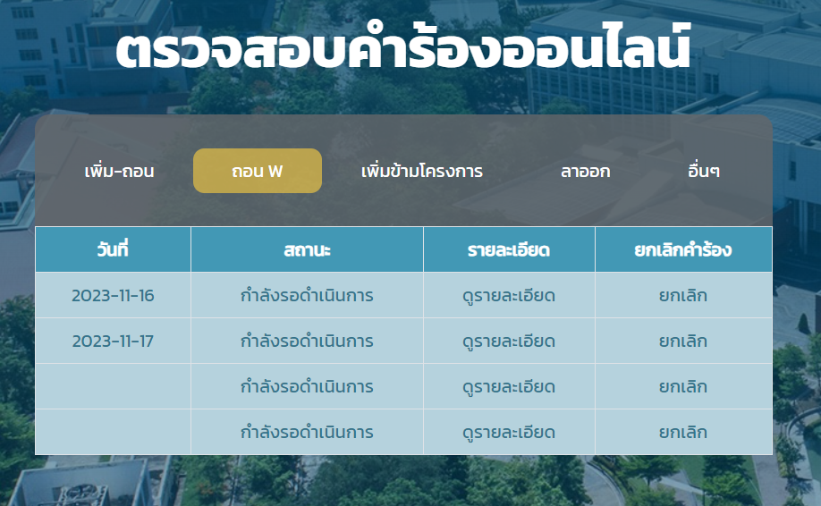

# CS264 1/66 - SubjectRequestForm

## What this project is about
This project is a web application that allows students to send various request(Add-Drop , DropOut , etc.) . And data will store in Microsoft Azure SQL Database . The application is built using Spring Boot and Java. 
## Tech Use
- Spring Boot 3.1.3
- Java JDK 17
- Trello
- Git
- Intellij IDEA

## Features
### Login Authentication with TU API 
User can login with their TU Wifi account and password. The application will use TU API to verify the user. If the user is not in the database, the application will tell the user their account is not in the database.

### Check User Status & Permission
This Application can handle 3 Type of User. And it can detect what type of user from TU API
- Student 
- Teacher 
- Employee

### Send Request
Student can send various request to the system. The system will store the request in the database and send the request to the admin.  
The List of Request that student can send are:
- เพิ่มถอนรายวิชา
- ถอน W ล่าช้า
- จดทะเบียนข้ามโครงการ
- เขียนคำร้องลาออก
- คำร้องอื่นๆ  

In each request will have different form to fill.
### See Request Status
Student can see their request status in the system. The system will show the status of the request in each category.


## How to run this project
### What you need to know
Our Application is using Microsoft Azure SQL Database. So you need to have Microsoft Azure SQL Database account and permission to run this project.  
But if you want to run this project with your own database. You can change the database configuration in `application.properties` file and follow the Database Preparing Instruction.

### Prerequisite (For run with Our Microsoft Azure SQL Database)
- Java JDK 17
- Intellij IDEA or other IDE that can handle MAVEN project
- Internet Connection (For connect to TU API)
- Microsoft Azure SQL Database Account
- Our Permission to access the database

### Database Preparing Instruction (skip this if using our database)
1. Create database named `cs264group2` in your database
2. Create table using our SQL Query in `SQL_Query\SQL_CreateTable.sql`
3. Change configuration in `application.properties` file to match your database configuration

### How to run
1. If you want to use our database , You need to contact us for permission to access the database. If you want to use your own database , Please Follow Database Preparing Instruction first.
2. Clone this project using git
    ```git
    git clone https://github.com/pakin6509681182/cs264-group2-100001.git
    ```
3. Open the project with Intellij IDEA or other IDE that can handle MAVEN project
4. Run the project file located in `subjectRequestForm/src/main/java/th/ac/tu/cs/subjectRequestForm/Hw1Application.java`
5. Open your browser and go to `localhost:8080`
6. If you're Current TU Student , You can login with your TU Wifi account and password.

### Troubleshoot
- When you run Our Application and stuck at
    ```
    HikariPool-1 - Starting...
    ```
You need to check your database configuration in `application.properties` file. Make sure it match your database configuration.
